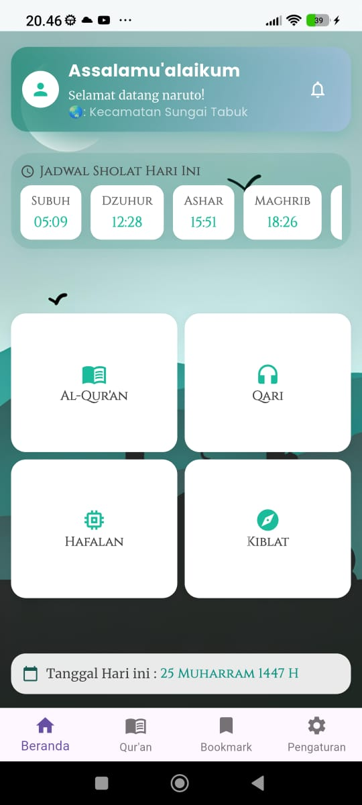
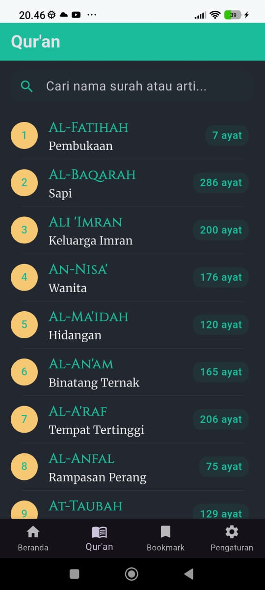
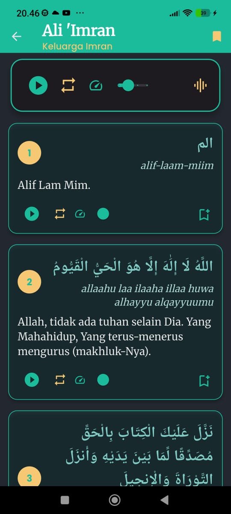
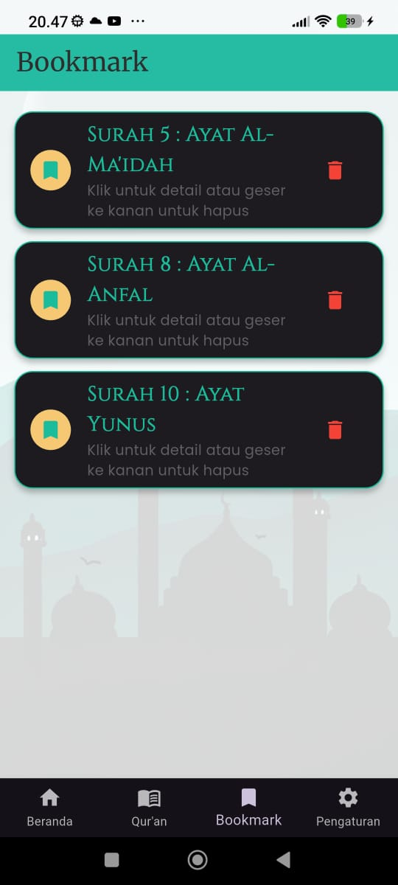

# 📖 HafalQ

**Aplikasi Flutter untuk membantu menghafal, membaca, dan memahami Al-Qur’an dengan mudah, modern, dan personal.**

---

## ✨ Fitur Utama

- ✅ Daftar surah lengkap dengan fitur pencarian
- ✅ Detail surah (teks Arab, latin, terjemahan, dan audio murottal)
- ✅ Bookmark ayat atau surah favorit untuk memudahkan belajar
- ✅ Pengaturan tampilan: mode gelap, ukuran font, dan volume audio
- ✅ Profil pengguna yang bisa disesuaikan
- ✅ Pengembangan dengan pendekatan metode **Tasmi'** (mendengar & mengulang)

---

## 🧩 Teknologi & API yang Digunakan

- Flutter (Mobile App Framework)
- [API Al-Qur’an - eQuran.id](https://equran.id/apidev/v2)
- [API Waktu Salat - Aladhan.com](https://aladhan.com/prayer-times-api)

---

## 🖼️ Tampilan Aplikasi

| Home | Detail Surah | List Surah | Bookmark |
|------|--------------|------------|----------|
|  |  |  |  |

---

## 🗂️ Dokumentasi & Desain

- 🎨 Desain UI di Figma: [Figma Mockup HafalQ](https://www.figma.com/design/YxXuaLBd8evNza9WLECGov/HafalQ-Mockup?node-id=0-1&t=iAw8LFQJiQ3EJJZr-1)
- 📊 Presentasi Proyek di Canva: [PPT HafalQ](https://www.canva.com/design/DAGq80zZohI/ace1DH8HF3fgQirvscb8uA/edit?utm_content=DAGq80zZohI&utm_campaign=designshare&utm_medium=link2&utm_source=sharebutton)
- 📑 Template Publish Jurnal: [IAES Template](https://section.iaesonline.com/index.php/IJEEI/index)
- 📎 Referensi PPT:
  - [Contoh PPT Bu Wifda](https://docs.google.com/presentation/d/1MRRwWpWTljIZ3nA8sjlD-8dci_0V3cuC/edit?slide=id.p2#slide=id.p2)
  - [Template PPT Bu Wifda](https://docs.google.com/presentation/d/1QaPUQio3Ql3k4As-Eopr3k67TXnHg5LW/edit?slide=id.p36#slide=id.p36)

---

## 👨‍💻 Tim Pengembang

| Peran           | Nama                            |
|-----------------|---------------------------------|
| Scrum Master    | Wifda                           |
| Product Owner   | @Anwar                          |
| UI/UX Designer  | @Lutfan                         |
| Frontend Dev    | @Fahrul Bahri (TI23B)           |
| Backend Dev     | @Hafiz                          |

> 🧠 *Tim mengadopsi struktur PO tanpa PM, dengan pendekatan kolaboratif saling backup.*

---

## 📌 Changelog

Lihat perubahan dan versi terbaru di [Release Page](https://github.com/mkasplanwar/HafalQ/releases)

---

## 🚀 Instalasi & Kontribusi

> Panduan instalasi dan kontribusi akan tersedia di `CONTRIBUTING.md` _(dalam pengembangan)_.

---

## 💡 Tentang HafalQ

**HafalQ** dibuat dengan semangat membantu siapa pun untuk lebih dekat dengan Al-Qur’an.  
Dengan desain modern, fitur lengkap, dan pendekatan tasmi’, HafalQ ingin menjadi teman setia dalam proses menghafal dan memahami Al-Qur’an.

---
